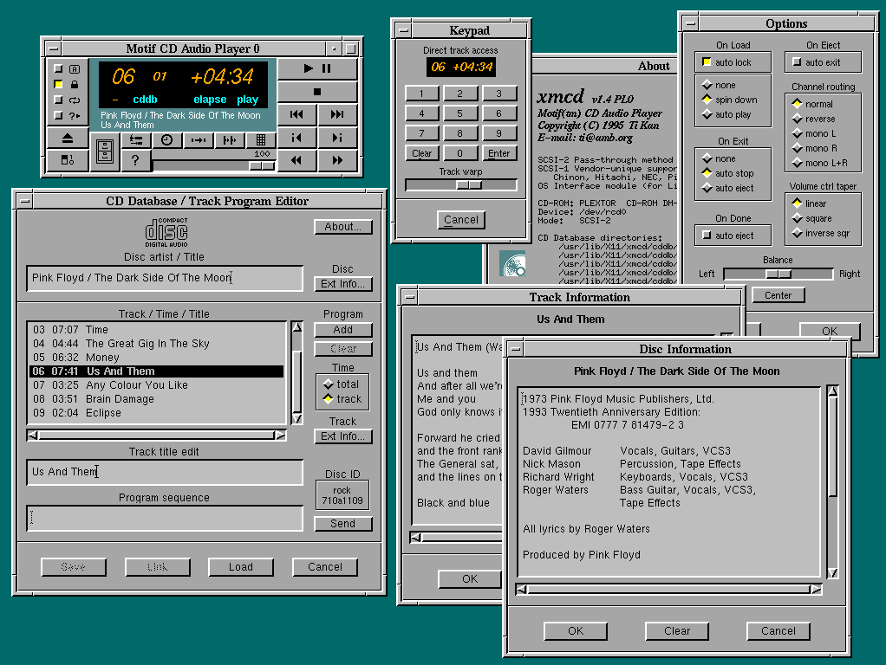

:data-transition-duration: 400
:author: Simon Werner
:skip-help: false
:css: style.css

.. title:: Simon's Desktop
.. note::
    - Preparation:
        - Network

----

Simon's Linux Desktop
=====================

----

Me
==

- Using Linux since 1998
- Extensively used many desktop environments:

    - GNOME
    - KDE
    - Blackbox / Fluxbox
    - XFCE
    - Enlightement

----

- Use Linux daily for work and private.
- Mainly Ubuntu / Debian based distros.

----

Today
=====

- X11 vs Wayland
- My Ubuntu GNOME
- Your Linux DE

----

X11
===

- Based on X10 protocol from 1984
- Designed for networked terminals
- Many issues in core protocol cause:

    - Poor bahviour with inputs
    - Features like touchscreen are tricky
    - Screen tearing, flickering, latency

----

----

Demo
====

----

Wayland
=======

- "Every frame is perfect"
- Replacement of X11 display server
- Many applications have to be re-written
- Is available now:

   - Fedora as default display server
   - Ubuntu will be default in 17.10

----

Further "reading"
=================

https://www.youtube.com/watch?v=cQoQE_HDG8g
https://www.youtube.com/watch?v=Zsz7Shbnb9c

----

Demo
====

----

My Ubuntu GNOME
===============

----

GNOME is better (IMHO) than the rest.

----

90% Vanilla

----

GNOME Tweak Tool

----

GNOME accounts: Google Calandar integration

----

- Multiple Desktops
- Everything is a key away

----

Text Editor => Atom
===================

- Multiple cursors
- Many plug-ins
- Activiley developed
- Works well with everything out-of-the-box
- Awesome git integration

----

Terminal => Tilix
=================

----

Non-opensource
==============

- Chrome
- Skype
- WebStorm

----

Custom Scripts
==============

- Backup locally (rsync => HDD)
- Cloud backup (duplicity => s3)

----

Pet Peeves
==========

- X11
- Multi-monitor support clunky

----

Your Linux DE / Applications
============================

----

Thanks
======
